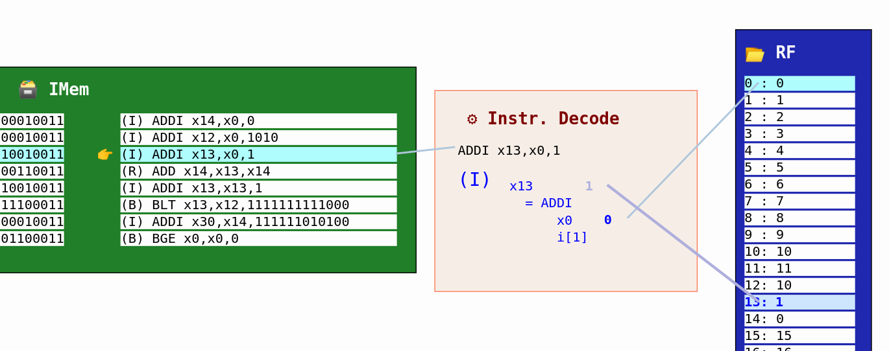

# Building a RISC-V CPU Core

## Course Description

This free mini-workshop, offered by by [Steve Hoover](https://www.linkedin.com/in/steve-hoover-a44b607/) of [Redwood EDA, LLC](https://redwoodeda.com), [Linux Foundation](https://www.linuxfoundation.org/), and [RISC-V International](https://riscv.org) is a crash course in digital logic design and basic CPU microarchitecture. Using the Makerchip online integrated development environment (IDE), you’ll implement everything from logic gates to a simple, but complete, RISC-V CPU core. You’ll be amazed by what you can do using freely-available online tools for open-source development. You’ll walk away with fundamental skills for a career in logic design, and you’ll position yourself on the forefront by learning to use the emerging Transaction-Level Verilog language extension (even if you don’t already know Verilog).

This course is available [in this repository](https://github.com/stevehoover/LF-Building-a-RISC-V-CPU-Core-Course/blob/main/course.md) as well as via the [EdX platform](https://www.edx.org/course/building-a-risc-v-cpu-core) (with a certification option). Thousands have registered and/or completed this course, [including Claude](https://www.linkedin.com/posts/steve-hoover-a44b607_aitl-verilog-activity-7110383796658520066-LGzp) (Anthropic's AI chatbot):

*If I were an actual student, I would give you glowing ratings as an instructor!*

&nbsp; &nbsp; &nbsp; *--Claude*

## Welcome

Congratulations for taking this step to expand your knowledge of computer hardware.

At this time, there are no course corrections or platform issues to report. Please do let us know within the EdX platform if anything gets in your way. There's a great deal of infrastructure to maintain for the course, and we aim to keep it all running smoothly. Now, please head back to [EdX](https://www.edx.org/course/building-a-risc-v-cpu-core) or the [Markdown version](course.md) of this course and continue.

## RISC-V Starting-Point Code

To begin the first RISC-V lab, when instructed to do so, Ctrl-click this link to <a href="https://makerchip.com/sandbox?code_url=https:%2F%2Fraw.githubusercontent.com%2Fstevehoover%2FLF-Building-a-RISC-V-CPU-Core%2Fmaster%2Frisc-v_shell.tlv" target="_blank" atom_fix="_">open starting-point code in makerchip</a>.

## RISC-V Reference Solution

In case you get stuck, we've got your back! These <a href="https://makerchip.com/sandbox?code_url=https:%2F%2Fraw.githubusercontent.com%2Fstevehoover%2FLF-Building-a-RISC-V-CPU-Core%2Fmain%2Frisc-v_solutions.tlv" target="_blank" atom_fix="_">reference solutions</a> (Ctrl-click) will help with syntax, etc. without handing you the answers.

Here's a pre-built logic diagram of the final CPU. Ctrl-click here to [explore in its own tab](https://raw.githubusercontent.com/stevehoover/LF-Building-a-RISC-V-CPU-Core/main/lib/riscv.svg).

## Finished!

Congratulations!!!

After completing this course, we hope you are inspired to continue your journey. These ideas might help:
  - Try the tutorials in [Makerchip](https://makerchip.com).
  - Learn more about [TL-Verilog](https://redwoodeda.com/tl-verilog).
  - Explore the [RISC-V](https://riscv.org) ecosystem.
  - Take [other courses](https://training.linuxfoundation.org/full-catalog/) from [Linux Foundation](https://www.linuxfoundation.org/)
  - Discover [other training](https://www.redwoodeda.com/publications) from [Redwood EDA, LLC](https://redwoodeda.com)
  - Get your core running on real hardware using FPGAs [in the cloud](https://github.com/stevehoover/1st-CLaaS) or [on your desktop](https://github.com/shivanishah269/risc-v-core/).
  - Install [TL-Verilog tools](https://www.redwoodeda.com/products).
  - Learn about the [WARP-V](https://github.com/stevehoover/warp-v) TL-Verilog CPU core generator.
